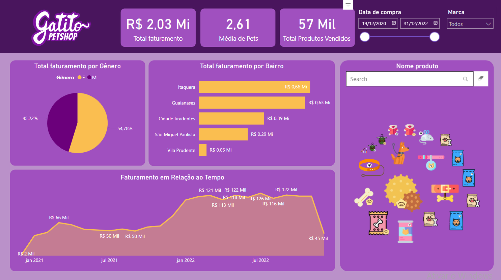

# Curso-BI-Gatitos
## Dashboard Interativo com Power BI

## Imagem com Link

## Relatório Financeiro do Pet Shop Gatitos

Este projeto foi desenvolvido como parte do curso de Power BI oferecido pela Alura. O objetivo principal foi criar um relatório financeiro detalhado para o Pet Shop Gatitos, que possibilitasse a obtenção de insights valiosos para o gerenciamento financeiro e a tomada de decisões estratégicas.

## Visão Geral do Projeto

O relatório financeiro criado fornece uma análise abrangente dos dados financeiros do Pet Shop Gatitos. Utilizando as ferramentas e funcionalidades do Power BI, foram exploradas diversas métricas e indicadores chave de desempenho (KPIs) que auxiliam na compreensão da saúde financeira do negócio.

### Funcionalidades Principais

1. **Dashboard Interativo**: Um painel interativo que permite a visualização rápida e intuitiva dos principais indicadores financeiros.
2. **Análise de Receitas e Despesas**: Visualizações detalhadas das receitas e despesas ao longo do tempo, permitindo a identificação de padrões e tendências.
3. **Métricas de Desempenho**: KPIs como margem de lucro, crescimento de receita e custos operacionais.
4. **Análise Comparativa**: Comparações entre diferentes períodos (mensal, trimestral, anual) para identificar variações e sazonalidades.
5. **Segmentação de Clientes**: Insights sobre o comportamento e perfil dos clientes, possibilitando estratégias de marketing mais eficazes.

### Insights Obtidos

Durante o desenvolvimento do projeto, vários insights importantes foram descobertos:

- **Identificação de Períodos de Alta e Baixa Receita**: Permitindo um planejamento mais eficaz de ações promocionais e de estoque.
- **Análise de Despesas**: Compreensão detalhada dos principais custos, possibilitando ações para a redução de despesas e aumento de eficiência operacional.
- **Perfil dos Clientes**: Identificação dos principais segmentos de clientes, ajudando na criação de campanhas de marketing direcionadas.

### Tecnologias Utilizadas

- **Power BI**: Ferramenta principal para a criação do relatório, utilizando suas capacidades de integração de dados, visualização e análise.
- **Excel**: Para manipulação inicial e limpeza dos dados antes da importação para o Power BI.

## Como Executar o Projeto

Para visualizar o relatório, siga os passos abaixo:

### 1. Pré-requisitos:

- Microsoft Power BI Desktop instalado no seu computador.

### 2. Abrir o Arquivo do Projeto:

- Baixe o arquivo do projeto (.pbix) do repositório.
- Abra o Microsoft Power BI Desktop.
- Selecione "Arquivo" > "Abrir" e escolha o arquivo do projeto.

### 3. Explorar o Relatório:

- Navegue pelas diferentes páginas e interaja com os visuais para explorar os dados.

## Conclusão

Este projeto demonstrou a eficácia do Power BI como uma ferramenta poderosa para análise financeira. Através do relatório desenvolvido, o Pet Shop Gatitos agora possui uma visão clara e detalhada de sua saúde financeira, permitindo uma gestão mais informada e estratégica.

Esperamos que este relatório seja um recurso valioso para o Pet Shop Gatitos e que sirva como um exemplo do potencial do Power BI para outras empresas.

## Agradecimentos

Agradecemos à equipe da Alura pelo suporte e pela excelente estrutura do curso, que foi fundamental para a realização deste projeto.

